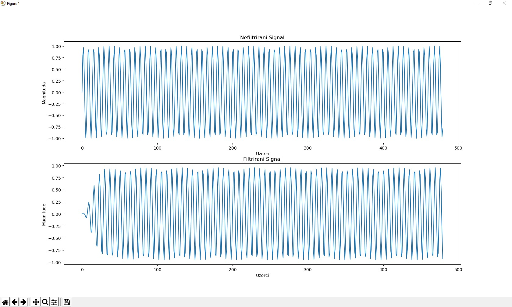
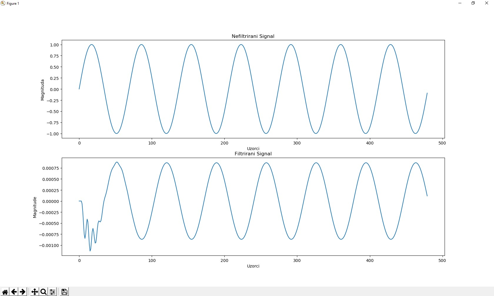

Bandpass филтер или BPF, је уређај који преноси фреквенције у одређеном распону и одбија (пригушује) фреквенције изван тог распона.

Опис

Бандпасс је придев који описује тип филтрирања или процеса филтрирања; треба га разликовати од пропусног опсега, који се односи на стварни део погођеног спектра. 
Дакле, могло би се рећи да "Двоструки пропусни филтер има два пропусна опсега." 
Сигурносни опсег је сигнал који садржи опсег фреквенција које нису суседне нултом фреквенцији, као што је сигнал који излази из опсега.
У пракси, ниједан пропусни филтер није идеалан. 
Филтер у потпуности не смањује све фреквенције изван жељеног фреквенцијског опсега; посебно, постоји област непосредно изван предвиђеног пропусног опсега у којој су фреквенције ослабљене, али нису одбачене. 
То се назива превртање филтера и обично се изражава у dB пригушења по октави или деценији фреквенције.
Генерално, дизајн филтра тежи томе да се роло увлачи што је могуће, на тај начин омогућавајући филтру да делује што ближе предвиђеном дизајну. 
Често се ово постиже на штету пропусног опсега или ритма појаса.

Пројекат

Да бисмо пустили у рад филтер потребно је унети фреквенцију коју желимо да филтрирамо и програм извешава филтрирање, плотује нефилтрирани и филтрирани сигнал ради упоређивања.

Филтрирање се врши преко формуле : 

y[n] = 0.0101*x[n] - 0.0202*x[n-2] + 0.0101*x[n-4] + 2.4354*y[n-1] - 3.1869*y[n-2] + 2.0889*y[n-3] - 0.7368*y[n-4] 

Пример филтриранја фреквенције од 7000Hz:

Пример филтрирања фреквенције 0д 700Hz:

Примена

Бандпасс филтри се широко користе у бежичним предајницима и пријемницима. 
Главна функција таквог филтера у предајнику је да ограничи пропусну ширину излазног сигнала на опсег додељен за пренос. 
Ово спречава да предајник не омета друге станице. 
У пријемнику, појасни филтер омогућава сигнале унутар одабраног опсега фреквенција да се чују или декодирају, док спречава продирање сигнала на нежељеним фреквенцијама. 
Бандпасс филтер такође оптимизује однос сигнал-шум и осетљивост пријемника.

И у апликацијама за одашиљање и примање, добро дизајнирани опсежни филтри, који имају оптималну пропусну ширину за начин и брзину комуникације који се користе, 
максимизирају број предајника сигнала који могу постојати у систему, истовремено минимизирајући сметње или конкуренцију међу сигналима.

Поред електронике и обраде сигнала, један пример употребе појасевних филтера је у атмосферским наукама. 
Уобичајено је да се филтрирају новији метеоролошки подаци у опсегу пролаза у периоду од, на пример, 3 до 10 дана, 
тако да остају само циклони као нестабилности у пољима података.

